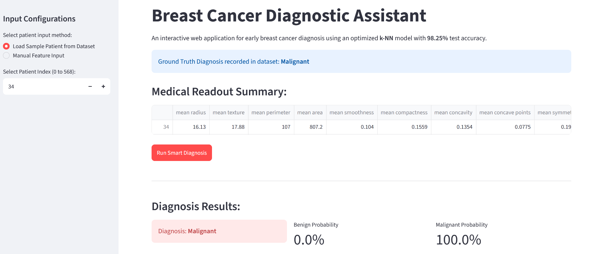

# 🔬 End-to-End Breast Cancer Diagnostic System (k-NN)

[](https://knn-breast-cancer-diagnostic.streamlit.app/)
[](https://www.python.org/)
[](https://opensource.org/licenses/MIT)

An enterprise-ready, modular Machine Learning system for early breast cancer diagnosis using an optimized **k-Nearest Neighbors (k-NN)** algorithm. The project transitions seamlessly from exploratory data analysis to a structured production-grade pipeline integrated with an interactive **Streamlit** web application.

 **Live Web Application:** [https://knn-breast-cancer-diagnostic.streamlit.app/](https://knn-breast-cancer-diagnostic.streamlit.app/)

---

## Dashboard Preview



---

##  Key Metrics & Performance Highlights

- **Test Accuracy:** `98.25%`
- **Train Accuracy:** `97.80%` (Validated against overfitting via 5-Fold Cross-Validation)
- **Optimization Strategy:** Systematic hyperparameter tuning using `GridSearchCV` (`n_jobs=-1`)
- **Architecture:** Modular ML Workflow (`data/`, `models/`, `notebooks/`, `app.py`, `streamlit_app.py`)
- **Deployment:** Hosted on Streamlit Community Cloud featuring real-time probabilistic scoring and sample patient selection.

---

##  Repository Structure

```text
knn_project/
├── data/
│   ├── raw/                      # Raw dataset (breast_cancer.csv)
│   └── processed/                # Scaled & split data artifacts
├── models/                       # Serialized production artifacts
│   ├── scaler.pkl                # Fitted StandardScaler object
│   └── knn_model.pkl             # Best estimator model artifact
├── notebooks/                    # Sequential modular development notebooks
│   ├── 01_data_preprocessing.ipynb
│   ├── 02_model_training_tuning.ipynb
│   └── 03_model_evaluation_inference.ipynb
├── app.py                        # Decoupled inference engine module
├── streamlit_app.py              # Streamlit Web Dashboard UI
├── requirements.txt              # Project dependencies & environment specs
└── README.md                     # Project documentation  ```

## Local Installation & Setup
#### 1. Clone the Repository:
git clone [https://github.com/Diraribnsalah/knn-breast-cancer-diagnostic.git](https://github.com/Diraribnsalah/knn-breast-cancer-diagnostic.git)
cd knn-breast-cancer-diagnostic
#### 2. Set Up Virtual Environment & Dependencies:
python -m venv venv
source venv/bin/activate  # On Windows: venv\Scripts\activate
pip install -r requirements.txt
## Run Web Dashboard
streamlit run streamlit_app.py
